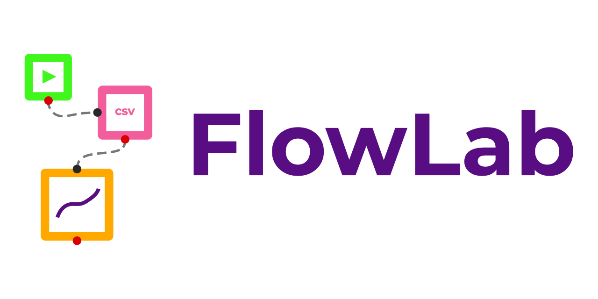

# FlowLab

<a property="dct:title" rel="cc:attributionURL" href="https://github.com/mahesh-gfx/FlowLab-Prototype">FlowLab</a> by <a rel="cc:attributionURL dct:creator" property="cc:attributionName" href="https://github.com/mahesh-gfx">Mahesh Adhikari</a> is licensed under <a href="https://creativecommons.org/licenses/by-nc-sa/4.0/?ref=chooser-v1" target="_blank" rel="license noopener noreferrer" style="display:inline-block;">Creative Commons Attribution-NonCommercial-ShareAlike 4.0 International</a>

## Project Overview

FlowLab is a flexible node-based workflow tool for pre-processing data, creating and displaying data visualisation workflows.

## Table of Contents

- [FlowLab](#flowlab)
  - [Project Overview](#project-overview)
  - [Table of Contents](#table-of-contents)
  - [Project Structure](#project-structure)
  - [Prerequisites](#prerequisites)
  - [Installation](#installation)
    - [`git clone https://github.com/mahesh-gfx/FlowLab-Prototype`](#git-clone-httpsgithubcommahesh-gfxflowlab-prototype)
    - [`npm i lerna`](#npm-i-lerna)
    - [`npx lerna bootstrap`](#npx-lerna-bootstrap)
  - [Available Scripts](#available-scripts)
    - [`npm run build`](#npm-run-build)
    - [`npm run start`](#npm-run-start)
    - [`npm run dev`](#npm-run-dev)
    - [`npm run dev:backend`](#npm-run-devbackend)
    - [`npm run start:frontend`](#npm-run-startfrontend)
    - [`npm run start:backend`](#npm-run-startbackend)
    - [`npm run build-nodes`](#npm-run-build-nodes)
    - [`npm run test`](#npm-run-test)
  - [Development](#development)
  - [Architecture](#architecture)
  - [Deployment](#deployment)
  - [Contributing](#contributing)
  - [License](#license)
  - [Acknowledgements](#acknowledgements)

## Project Structure

The project is organized into the following packages:

- `shared`: Common utilities and components shared across other packages
- `nodes`: Node-based logic for data processing and visualization
- `backend`: Server-side application
- `frontend`: Client-side application
- `druidjs`: Custom package for data querying and processing

## Prerequisites

- Node.js v19.9.0
- npm 9.6.3
- Git

## Installation

1. Clone the repository:
   ### `git clone https://github.com/mahesh-gfx/FlowLab-Prototype`
2. Install Dependencies
   ### `npm i lerna`
   ### `npx lerna bootstrap`

## Available Scripts

In the project directory, you can run:

### `npm run build`

Builds all packages in the project.

### `npm run start`

Starts all packages in the project concurrently and the app opens on your default browser

### `npm run dev`

Runs both the backend (in dev mode) and frontend concurrently, with color-coded output.

### `npm run dev:backend`

Runs the backend in development mode.

### `npm run start:frontend`

Starts only the frontend application.

### `npm run start:backend`

Starts only the backend application.

### `npm run build-nodes`

Builds the nodes package and updates dependencies in the backend and frontend packages.

### `npm run test`

Runs tests for all packages.

## Development

This project uses Lerna for managing multiple packages in a single repository.

## Architecture

FlowLab follows a modular architecture:

1. **Frontend**: Built with React, it provides an interactive user interface for creating information visualisation workflows.
2. **Backend**: Powered by Express and Node.js, it handles data processing, storage, and serves the APIs.
3. **Nodes**: Declarative class based nodes for creating data processing and visualisation logic.
4. **DruidJS**: A specialized package for efficient data querying and analysis developed by Rene Cutura; Christoph Kralj; Michael Sedlmair. [DRUIDJS — A JavaScript Library for Dimensionality Reduction](https://doi.org/10.1109/VIS47514.2020.00029) Github: [saehm/DruidJS: A JavaScript Library for Dimensionality Reduction](https://github.com/saehm/DruidJS). There were some build related issued by incompatibility of the package with the project's configuration. Hence, this package was cloned, typedefinitions were written for the modules used in the project, and the package was built.
5. **Shared**: Contains common utilities and types used across the application.

## Deployment

1. Set up environment variables:

- Create a `.env` file in the root directory
- Add necessary environment variables (refer to `.env.example` inside the package directories)

2. Build the project: `npm run build`

3. Deploy the backend:

- Backend can be deployed on services like AWS EC2, using PM2. **(Currently exploring other options)**.

1. Deploy the frontend:

- The frontend can be built and deployed separately. It can even be deployed as a static web app.

## Contributing

We welcome contributions to the FlowLab! Please follow these steps:

1. Fork the repository
2. Create a new branch: `git checkout -b feature/your-feature-name`
3. Make your changes and commit them: `git commit -m 'Add some feature'`
4. Push to the branch: `git push origin feature/your-feature-name`
5. Submit a pull request

Please read [CONTRIBUTING.md](CONTRIBUTING.md) for our code of conduct and the process for submitting pull requests. (coming soon...)

## License

This project is licensed under the Creative Commons Attribution-NonCommercial-ShareAlike 4.0 International License.  
To view a copy of this license, visit [https://creativecommons.org/licenses/by-nc-sa/4.0/](https://creativecommons.org/licenses/by-nc-sa/4.0/).

## Acknowledgements

- My sincere gratitude to [René Cutura](https://github.com/saehm) and the contributors of the DRUID.js project for their invaluable work. The DRUID.js library, as hosted on their GitHub repository, has been an important component of this project.
